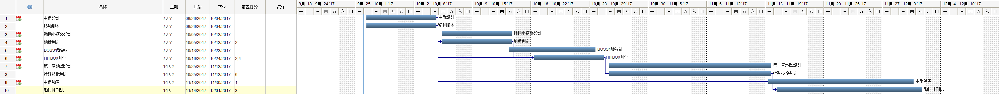

# 組別:第21組
## 成員:0424085 葉柏廷 (0424032 崔恩偉 0424046李俊岳 (B班))
### 專題題目:橫向卷軸遊戲設計
#### 指導教授:黃文楨 教授
##### 專題內容:以類惡魔城為基礎設計一款橫向卷軸動作遊戲，我們將設計許多能力讓主角使用，突破層層關卡，並加入些許解謎要素，使遊戲內容更加豐富。
##### 效益: 1. 動作遊戲帶給人的愉悅感。
#####       2. 解謎要素給人解開謎底的成就感，促使腦袋運轉。
###### 介面:

